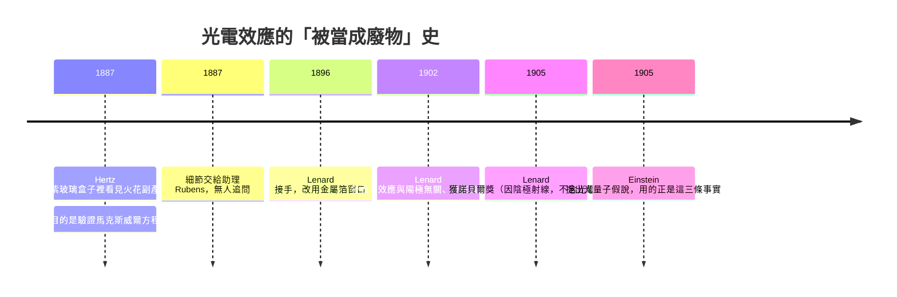

# 2.1 赫茲與倫納德：一個被當成「廢物」的現象

## 1887 年，一個紫玻璃盒子裡的火花

1887 年，德國卡爾斯魯厄的赫茲（Heinrich Hertz）正在做一件全世界只有他覺得重要的事：用實驗證明**看不見的電磁波真的存在**。這是馬克斯威爾方程組的判決書——如果波是真的，讓線圈放電產生的火花去激發另一個線圈，就該在接收端感應到火花。

火花太小、太短命，眼睛看不清。赫茲在接收線圈旁架了一個**金屬缺口**，讓放電產生的紫外光先照過缺口。接上感應線圈時，缺口裡就跳出更亮的火花；用玻璃板擋住則變弱，玻璃上開個小孔讓光穿過，火花又回來。

對赫茲這是完美的：紫外光是「光」，紫外光讓電火花變容易，說明**光確實能對電產生作用**。論文發表，馬克斯威爾的棺材釘死了。

那個紫玻璃盒子裡「火花突然變亮」的副產品，被赫茲自己擱在旁邊。他大意是表示，這個細節他沒時間研究，不是他工作的目標。線索交給了助理海因里希·魯本斯（Heinrich Rubens）。此後沒有人回頭看那個盒子。

## 1896 年：一片金箔，把整個實驗改造了

接線的是赫茲的學生菲利普·倫納德（Philipp Lenard, 1862–1943）。第一個麻煩很物理：電子要穿過管壁才能出來，而玻璃擋紫外光。

倫納德的解法簡單到令人吃驚：**在管壁開一個小窗口，蓋一片極薄的金屬箔**。於是管內的真空與管外空氣被這片箔隔開，電子仍可穿過箔跑出來。

這一步的意義遠超「方便」：光必須**先穿過真空才能打到電子**；而且光電流的絕對值變小了——電子要穿過箔阻力更大。但最關鍵的一句是：

> 效應本身**沒有消失**。

舊設計裡那個可疑的效應（會不會其實是空氣放電？），在金屬箔後面依然存在。**這一次改造排除了雜訊解釋。** 科學史上很重要的一類實驗，起點就是這樣一次「把汙染關在門外」。

## 倫納德的三條事實

倫納德用多種材料當陰極，系統掃描波長與光強，得到三條結論。它們是整個量子故事的骨架，因為**波動說三條都解釋不了**。

| 編號 | 事實 | 困境 |
|---|---|---|
| (a) | 效應**存在與否只取決於頻率**，與強度無關 | 波動說認為光強越大、每電子分到的能量越多，總該跨過任何門檻 |
| (b) | 效應只取決於**陰極材料**，與陽極用什麼無關 | 若發生在兩極間的空間，換陽極應該有影響；不影響，代表發生在**材料內部** |
| (c) | 每種材料有**臨界頻率** $\nu_0$，低於它，強度再大都沒有電子跳出 | 最致命的一條：波動說沒有「門檻」這個概念 |

(a) 和 (c) 常被混為一談，其實獨立。假設光是一團平均分佈的能量，強度翻倍代表能量翻倍——那 (c) 那道「不夠亮就永遠不行」的牆究竟從哪裡來？

倫納德還量了**遏止電位**（stopping potential）$V_0$：加反向電壓把光電流壓到剛好為零所需的那個電壓。他量得很準，但當時沒人知道它代表什麼能量，於是它成了一串沒有理論的數字。

**波動說的困境一句話講完**：波動說預測「弱光下電子要累積一段時間才能跳出，有延遲」；倫納德看到的是「低於 $\nu_0$ 時，再弱的單色光也永遠跳不出來」。連續累積與硬門檻，不可能同時對。

| 陰極材料 | 臨界頻率 $\nu_0$（約，Hz） | 截止波長 $\lambda_0=c/\nu_0$ | 說明 |
|---|---|---|---|
| 鉀 K | $4.58\times10^{15}$ | 約 0.65 μm | 門檻最低，19 世紀末的實驗多半用鹼金屬 |
| 鈉 Na | $6.03\times10^{15}$ | 約 0.50 μm | 密立根用得最多的兩種 |
| 鋅 Zn | 約 $9.5\times10^{15}$ | 約 0.32 μm | 典型「非紫外不可」的材料 |
| 鉑 Pt | 約 $1.3\times10^{15}$ | 約 0.23 μm | 門檻遠在紫外，玻璃實驗照不到 |

（表內為二十世紀初的實測量級；較精確數字見 2.2 節。）

注意鋅的 $\lambda_0$ 在紫外區——這就是 1887 年赫茲那個紫玻璃盒子**必然**有東西的原因：門檻在可見光之上的材料，用可見光怎麼打都沒反應。## 一個被獎勵的旁枝

倫納德 1905 年拿到諾貝爾物理學獎，但官方理由是他在**陰極射線**上的貢獻；委員會事後還特別說明，這筆獎並沒有把他的光電效應工作考慮在內。

諷刺擺在這裡：光電效應是他職業生涯裡最正確的觀察，但讓他得獎的是另一件工作；而證明它**真實存在**的關鍵改進（金箔窗），本身也只是副產品裡的副產品。

三條事實在原地躺了九年，等一個肯於假設「光不是波」的人。下一節先不給他，我們看反方陣營：密立根。

## 本章小結

- **赫茲 1887 年**在驗證電磁波的實驗裡撞見光電效應，當成「光能對電產生作用」的副產品，隨手交給助理魯本斯。
- **倫納德 1896 年**的關鍵改進是用**極薄金屬箔窗口**把真空管與外部驗電器隔開。效應變弱但沒消失，一次排除了空氣放電等雜訊解釋。
- **事實 (a)**：只取決於頻率，與強度無關。**事實 (b)**：只取決於陰極材料——說明是材料內部的現象。**事實 (c)**：存在臨界頻率 $\nu_0$，低於它強度再大也無效。
- **(c) 對波動說最致命**：波動說只有連續的平均能量分配，沒有門檻。這是量子化必須被引進的直接理由。
- 倫納德 1905 年得諾貝爾獎的理由是**陰極射線**，委員會不認為涵蓋光電效應。
- 下一章的密立根將提供第一個**定量確認**，代價是他花了十年才承認。

## 想一想

1. 赫茲因為「光能影響電火花」確認了馬克斯威爾方程，卻把真正困難的效應丟在一邊。這種「順帶發現卻被丟棄」的模式在科學史上還發生過嗎？
2. 倫納德的 (b) 只排除了「效應對陽極材料完全不敏感」這一點。若有人主張「效應在兩極間的氣體中發生，只是恰好對某些氣體不敏感」，你要設計什麼實驗才能真正排除？
3. 今天我們知道答案是「光子」。但若沒有密立根那種**刻意不信任理論**的實驗文化，一個錯誤但自洽的模型能在科學界存活多久？第 2.5 節的諾貝爾獎歷史會給一個很難堪的答案。
