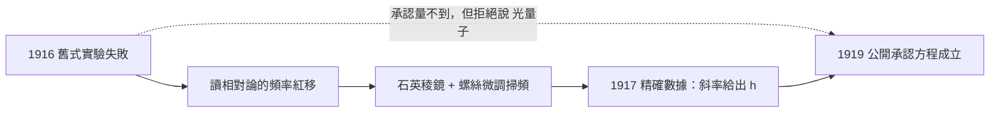

# 2.2 密立根的陰影：那些「失敗的實驗」

## 1913 年，芝加哥，一位喜歡用數字欺負年輕人的教授

羅伯特·密立根（Robert Millikan, 1868–1953）是芝加哥大學實驗物理學的大宗師。招牌本領是**把一個數字量到別人做不到的精度**：1909 到 1911 年，他把電子電荷 $e$ 測到 $1.602\times10^{-19}\ \mathrm{C}$，後來拿了諾貝爾獎。

他對量子論的敵意公開而持久。愛因斯坦 1905 年的光量子假說，在他的語言裡是**學生們（特別是愛德華·泰勒 Edward Teller）策劃的陰謀**。他還有一句被後人記住的話，大意是：那時的年輕人普遍覺得自己特別聰明，什麼都想重新發現一遍，但迄今沒有任何實驗支持他們。

這段話有雙關：他本人就是「實驗才是硬道理」最徹底的踐行者；但因為執行得太徹底，他整整十年不肯承認愛因斯坦的方程。

## 密立根量的是電壓，不是速度

愛因斯坦方程牽涉電子動能 $\frac{1}{2}mv^2$。密立根拒絕測電子速度——要測速度得用磁場偏轉，麻煩、誤差大。他改測**遏止電位**（stopping potential）$V_0$：把陽極做成負電壓，光打出的電子被電場推回陰極，直到光電流歸零；那個臨界電壓乘上元電荷 $e$ 就是電子最大動能，

$$eV_0 = \tfrac{1}{2}mv^2_{\max}$$

$e=1.602\times10^{-19}\ \mathrm{C}$，$V_0$ 用伏特，$m=9.11\times10^{-31}\ \mathrm{kg}$。量一個電壓，遠比量一個速度可靠——**用最好量的那個量**，是密立根式的核心。

裝置本身也很講究：石英入光窗（玻璃擋紫外）、真空石英光電管、金屬光柵單色儀（紫外段用鉑製刻線），以及一個**可以用螺絲微調的石英稜鏡**。最後這項是轉折點。

## 「失敗的實驗」：1916 年的鹼金屬

1916 年，密立根把 Hertz 和 Lenard 最早那種「各種材料輪流當陰極」的實驗重做一遍，包含鉀、鈉等鹼金屬。結果是**一堆不規則、無法重現的數據**——表面氧化層、殘留氣體、極窄光束的直徑都影響結果，而每一項他當時都控制不了。

密立根在論文中誠實寫明：他無法用這些實驗檢驗光量子的說法，甚至**放棄了**這條路。一個大牌實驗學家在招牌領域公開說「我量不出來」，不算常見。

## 轉捋：他讀的是相對論，不是光電論文

大約 1916 年，密立根讀了愛因斯坦的**相對論論文**。他從裡面抓到一件對實驗極有用的事：光源若在運動，它發出的光在實驗室座標系裡頻率會改變，

$$\nu = \nu_{\text{光源}}\sqrt{1-v^2/c^2}$$

$v$ 是光源速度，$c=2.998\times10^8\ \mathrm{m/s}$。**能連續改變光源速度，就能連續掃過波長。** 這正是他缺的那塊：先前他靠更換濾光片，頻率既不連續也不夠準。

於是密立根把石英稜鏡裝到能用螺絲微調的角度平台上：轉螺絲 → 改折射角 → 改到達光電管的單色光波長。一次連續掃描，解決頻率不精確的問題。

| 年份 | 做什麼 | 結果 |
|---|---|---|
| 1909–1911 | 精密測量電子電荷 | 招牌作，精度至今仍是標準 |
| 1916 | 重做舊式材料實驗（鉀、鈉等） | 數據不規則，公開承認無法檢驗光量子假說 |
| 1916 | 讀相對論，找到頻率紅移 | 發現掃頻原理 |
| 1917 | 發表精密結果 | 鈉 $\nu_0=6.03\times10^{15}\ \mathrm{Hz}$、鉀 $\nu_0=4.58\times10^{15}\ \mathrm{Hz}$，斜率給出 $h\approx6.626\times10^{-34}\ \mathrm{J\cdot s}$ |
| 1919 | 公開改口 | 承認愛因斯坦方程的經驗性成立 |

## 1917 年那條直線

把遏止電位對頻率作圖，密立根得到的是一條**直線**：

$$V_0 = \frac{h}{e}\nu - \frac{h\nu_0}{e}$$

$h$ 是普朗克常數（Planck's constant）$h=6.626\times10^{-34}\ \mathrm{J\cdot s}$；$h\nu_0$ 就是**逸出功**（work function）$W$，把電子從金屬內部拉到表面的最小能量。換成波長寫（$\nu=c/\lambda$）：

$$W = hc\left(\frac{1}{\lambda} - \frac{1}{\lambda_0}\right),\qquad \lambda_0=\frac{c}{\nu_0}$$

用現代的話說，密立根 1917 年做的事是：**量出那條直線的斜率，而斜率就是 $h/e$**。不同材料的 $\nu_0$ 不同，但 $h$ 相同——這是模型最關鍵的預測：普朗克常數是**物質的普世常數，與金屬無關**。

| 陰極材料 | 臨界頻率 $\nu_0$ | 逸出功 $W=h\nu_0$ |
|---|---|---|
| 鈉 Na | $6.03\times10^{15}\ \mathrm{Hz}$ | $\approx4.0\times10^{-18}\ \mathrm{J}\approx2.5\ \mathrm{eV}$ |
| 鉀 K | $4.58\times10^{15}\ \mathrm{Hz}$ | $\approx3.0\times10^{-18}\ \mathrm{J}\approx1.9\ \mathrm{eV}$ |

（$1\ \mathrm{eV}=1.602\times10^{-19}\ \mathrm{J}$。）

## 但他還是不說「光量子」

1917 年那篇論文題目是 "On a Photoelectric Effect"。他拒絕使用「光量子」這個詞，只說那是「某種形式的能量單位」；也一直拒絕計算電子動能，只信自己的電壓數字。1919 年他終於公開改口，大意是：他放棄了企圖證明波動說的嘗試，不得不承認愛因斯坦方程在經驗上成立。

密立根的方法論是「**絕對不信任何未經我親手精密測量的東西**」。這在科學上極寶貴——它逐出了無根據的理論。但當理論要求的靈敏度超出當時技術時，執行得越徹底，落空得越徹底。

下一節回到 1905 年，看那條線是怎麼被畫出來的。

## 本章小結

- 密立根是電子電荷精密測量的宗師，也是**量子論最頑固的敵人**，把光量子假說說成學生 Teller 的陰謀。
- 他拒絕測電子速度，改測**遏止電位** $V_0$，用 $eV_0=\tfrac{1}{2}mv^2_{\max}$ 換算——**量最好量的那個量**是密立根式的核心。
- 1916 年他重做舊式材料實驗，得到無法重現的結果，並**公開承認無法用光電效應檢驗光量子假說**。
- 轉捩點是他讀了**相對論論文**：從頻率紅移得到掃頻原理，用石英稜鏡加螺絲微調解決頻率不精確的問題。
- 1917 年：鈉 $\nu_0=6.03\times10^{15}\ \mathrm{Hz}$、鉀 $\nu_0=4.58\times10^{15}\ \mathrm{Hz}$，材料不同但**斜率給出同一個 $h$**。
- 1919 年他公開承認愛因斯坦方程成立，但仍拒絕使用「光量子」一詞。

## 想一想

1. 密立根讀的是**相對論**論文，卻從裡面拿到解決光電實驗的關鍵。為什麼跨領域的知識常比同一領域的深挖更有用？
2. 密立根說「我量不出來」，卻沒說「你錯了」。這種只承認自己失敗、不承認對方正確的態度，在科學史上造成過哪些延誤？跟今天處理「可重現性危機」的做法比，你覺得一樣嗎？
3. 今天我們知道正確答案是「光子」。但若沒有密立根那種**刻意不信任理論**的實驗文化，一個錯誤但自洽的模型能在科學界存活多久？第 2.5 節的諾貝爾獎歷史會給一個很難堪的答案。
