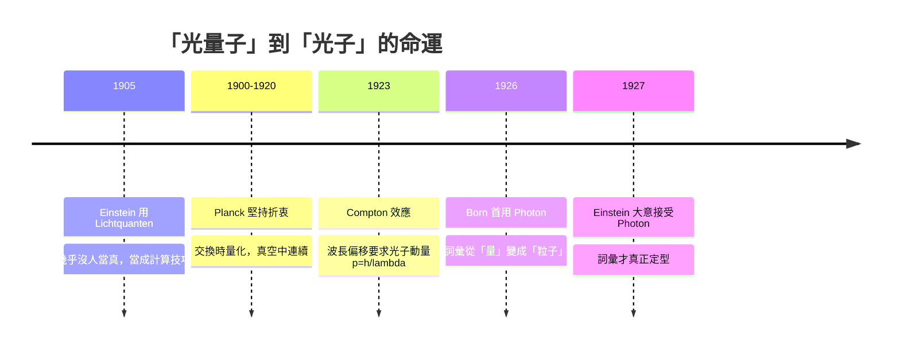

# 2.4 「光量子」這個詞的命運：Born 的提議與 Planck 的反對

## 1905 年：愛因斯坦說 Lichtquanten

愛因斯坦在 1905 年那篇光電效應論文裡，用的是德文詞 **"Lichtquanten"**（光量子）。這個詞在當時聽起來很刺耳。麥克斯韋（James Clerk Maxwell）已經把光徹底搞成了波：電場與磁場在真空中以波的形式傳播，干涉、繞射、偏振全都說得通。現在突然有人說「光其實是能量包」，等於要把整個十九世紀的光學推翻一半。

所以大多數人選擇了最舒服的解讀：把 $E=h\nu$ 當成**一個計算技巧**。只要技巧能算出正確答案，他們就接受；但絕不把它理解成「光在空間中真的是一粒一粒的」。

## Planck 的猶豫：他從沒同意過這個詮釋

馬克斯·普朗克（Max Planck, 1858–1947）是最尷尬的人之一。1900 年 12 月 14 日，為了解決黑體輻射的紫外災難（第 1 章），他**被迫**引進了能量量子化 $E_n = n h\nu$ 。但普朗克一輩子堅持：那個量子化只發生在**物質與輻射交換能量的瞬間**，而**光本身在真空中還是連續的波**。

愛因斯坦 1905 年把量子化直接搬到「光本身」，普朗克完全不能接受。他甚至後來試圖**改寫愛因斯坦光電方程的形式**，想把它包裝成看不出光量子痕跡的樣子。

這種立場現在看起來很矛盾，但放在當時是想盡量保住經典物理的大廈不倒。普朗克不是固執，他只是太清楚自己已經推翻了多少東西，又不想推翻得更多。

## 1923 年：Compton 效應把門關上

讓「光是粒子」從「可爭辯的啟發式」變成「無法迴避的事實」的，是阿瑟·康普頓（Arthur H. Compton, 1892–1962）1923 年發現的**康普頓效應**。

康普頓讓 X 射線撞擊石墨，發現散射出去的 X 射線**波長變長了**（紅移）。用經典電磁波永遠解釋不了這個偏移的大小。用光子模型（光子有動量 $p = h/\lambda = E/c$ ）一算，立刻得到：

$$\lambda' - \lambda = \frac{2h}{m_e c}\sin^2\frac{\theta}{2}$$

式子裡明明白白出現 $h$ ，而且整個計算是把光子當成**有動量的粒子**做彈性碰撞。第三章會詳細推導。這裡只記住：**1923 年之後，光子不再是數學捷徑，而是必要的實體。**

## 1926 年：Born 首度提出 "Photon"

"Quantum" 是拉丁文「量」的意思，聽起來抽象。關鍵轉折發生在 1926 年：馬克斯·玻恩（Max Born, 1882–1970）在教科書《關於碰撞過程的量子力學》（"Quantenmechanik der Stoßvorgänge"）中，**首次把 "Photon" 這個詞用在光子上**。據後世考據與敘述，大意是愛因斯坦到 1927 年 5 月左右才逐漸接受這個新詞。

有個細節很有味道：愛因斯坦本人長年都說 "Lichtquanten"，從沒主動改口。這個詞是**別人替他取的**，而且等到它已廣泛流行後他才接受。

| 詞彙 | 誰最先使用 | 時間 | 備註 |
|---|---|---|---|
| Lichtquanten | 愛因斯坦 | 1905 年 6 月 | 德文原詞，「光量子」 |
| light quantum | 英譯 | 1905–1920 年代 | 直譯，聽起來抽象 |
| Photon | Max Born | 1926 年 | 希臘文 φῶς（phōs，光）+ 粒子詞尾 -on |

這個詞構造得很成功：像 electron、proton 那串「粒子名詞」家族，很自然地把它歸類成一種**粒子**，而不是一種「量」。

## 一段友誼的裂縫

愛因斯坦與普朗克的通信從 1890 年代開始，將近四十年，最初是純粹的學術友誼。到了 1920 年代，光量子的爭論慢慢變成裂縫。

政治背景更複雜。一戰後的德國有反猶主義浪潮，普朗克公開**幫助過猶太科學家**（愛因斯坦、馬克思·勞厄 Max Laue）；與此同時，他的學生玻恩（Born）在 1933 年因猶太血統被剝奪教職、流亡英國。概念的爭執與時代的張力，就這樣疊在一起。

不過本書的原則是盡量不編細節，用事實說話。這裡只點出一件事：**概念之爭從來不是純粹的邏輯之爭，它總和時代、個性甚至政治糾纏在一起。** 玻恩的遭遇詳見 10.4。

## 一個正確的想法被接受，需要什麼？

「光量子」從 1905 年的刺耳，到 1926 年被命名為 "Photon"，再到今天變成日常用語，中間隔了二十一年。關鍵不是多了幾個數據點，而是出現了**一個新的理論需求**——Compton 效應要求它：波長偏移的公式裡若不出現 $h$ ，就沒有辦法解釋。

順帶一提，玻恩的詞還解決了「愛因斯坦自己也不叫 photon」這個尴尬。**一個概念定型的最後一步，有時是由命名完成的，不是由實驗完成的。**

## 本章小結

- 愛因斯坦 1905 年用 **Lichtquanten**（光量子），不是 Photon；當時多數人把它當「計算技巧」，不當實體。
- 普朗克一生反對把量子化推到「光本身」，主張量子化只發生在能量交換瞬間，光在真空中仍是連續波，甚至試圖改寫愛因斯坦方程來掩蓋光量子。
- **1923 年康普頓效應**是轉折：散射波長偏移的公式明確要求光子有動量 $p=h/\lambda$ ，光量子從「啟發式」變成「無法迴避的事實」。
- **1926 年玻恩**在教科書《Quantenmechanik der Stoßvorgänge》中**首用 "Photon"**；愛因斯坦大意到 1927 年才接受。詞是別人替他取的。
- 詞尾從 "quantum"（量）變成 "-on"（粒子），讓光重新歸類進 electron、proton 那個粒子家族。
- 概念被接受靠的不是時間，而是**新的理論需求**。正確的想法常要等舊解釋崩潰才被接納。

## 想一想

1. 普朗克明明自己最先引進 $E=nh\nu$ ，卻終生反對把它推到「光本身」。這種「我打開了門，卻不想讓別人走進去」的矛盾，科學史上還有哪些例子？
2. "Photon" 這個詞把光重新歸類成粒子，這個詞彙的選擇如何影響了理論的接受？現代科學裡，命名怎樣悄悄決定了思考方向？
3. 康普頓效應 1923 年才說服大多數人，但愛因斯坦 1905 年就已經正確。為什麼科學社群傾向等「決定性實驗」出現才改變立場，而不直接接受理論的邏輯預測？
