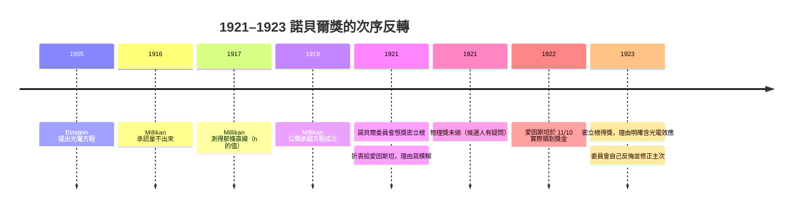

# 2.5 為什麼 1921 年的諾貝爾獎繞過了愛因斯坦

## 1922 年 11 月 10 日，斯德哥爾摩

1921 年的諾貝爾物理學獎頒給**愛因斯坦**。官方授獎理由寫得很客氣、很模糊：「由於他對理論物理學的貢獻，特別是由於他發現了光電效應定律」（"for his services to Theoretical Physics, and especially for his discovery of the law of the photoelectric effect"）。

但真實的故事繞了兩個大彎，時間軸也錯位了。**第一，愛因斯坦領獎的日期是 1922 年 11 月 10 日，不是 1921 年。** 因為 1920 年的物理獎當年並未頒發（委員會對候選人資格有疑問），於是 1921 年的獎金拖到 1922 年 11 月，和當年的物理、化學獎一起發放。

**第二，那句「特別是由於他發現了光電效應定律」的話，委員會自己並不完全相信。** 這才是本章的重點。

## 委員會想頒的是密立根

評審過程中，諾貝爾物理委員會的物理學家評語認為：截至 1921 年，**光電定律的實驗證據還不夠確立**。他們建議把獎頒給**密立根（Millikan）**——因為他是唯一做出了精密、系統、可重現的光電實驗的人。從 2.2 節我們知道密立根的數據有多硬：鈉 $\nu_0=6.03\times10^{15}\ \mathrm{Hz}$ 、鉀 $\nu_0=4.58\times10^{15}\ \mathrm{Hz}$ ，斜率給出 $h=6.626\times10^{-34}\ \mathrm{J\cdot s}$ 。

委員會內部並非一致。物理學家卡爾·貝內迪克斯（Carl Benedicks）寫了一封強烈反對的意見信。最後的折衷方案，是頒給愛因斯坦，但**把理由寫得故意模糊**——只提「對理論物理學的貢獻」，把「光電效應定律」寫成一個修飾性的補充，而不是唯一主因。

換句話說，**那個讓愛因斯坦得獎的東西（光電方程），恰恰是委員會最沒把握的一句。**

密立根的數據有多硬，可以從 2.2 節那條直線回頭看。 $V_0$ 對 $\nu$ 的斜率就是 $h/e$ ：

$$\frac{h}{e} = \frac{6.626\times10^{-34}}{1.602\times10^{-19}} \approx 4.136\times10^{-15}\ \mathrm{V\cdot s}$$

密立根從鈉與鉀兩種陰極分別定出截距（ $-h\nu_0/e$ ），算得 $\nu_0$ 分別為 $6.03\times10^{15}\ \mathrm{Hz}$ 與 $4.58\times10^{15}\ \mathrm{Hz}$ ；**兩條直線斜率相同**，這是光量子模型最乾淨的定量預測。委員會若嚴格按證據說話，這確實是當時最扎實的量測之一——所以它才會想獎給他。

| 年份 | 得獎人 | 授獎理由的重點 |
|---|---|---|
| 1921 | 愛因斯坦 | 對理論物理學的貢獻（光電效應定律以修飾語帶過） |
| 1922 | 肯尼斯·威爾金森（該年獎延至隔年才公布） | X 射線的吸收 |
| 1923 | 密立根 | 電子電荷的測量 + 光電效應（主次分明） |

## 兩年後，委員會自己反悔了

**這個主次排錯，兩年後被委員會自己修正。** 1921 年他們認為「密立根的實驗 + 愛因斯坦的理論」應該先獎實驗；1923 年密立根得獎時，理由已經明確包含光電效應。

這段順序本身就是一課：**諾貝爾獎是「當下委員會的最大理解」的快照，不是終審判決。** 把它當成歷史的權威判詞，會錯得很慘。

## 愛因斯坦自己完全不在意

愛因斯坦對這件事的態度是出了名的淡然。據說他表示過：如果諾貝爾獎是因為他其實並不認同的那個理論，他反而會**婉拒**。

更有名的說法是：有人（據說是他的朋友或記者）建議他把獎金全部捐給某個研究所，他回答他有一個更簡單的處理方式——把支票給妻子米蕾娃（Mileva），用來買傢俱。這個說法在文獻與回憶中廣為流傳，但措辭各家略有出入，此處只作為「據說」記錄，不作定論。

需要說明的是，愛因斯坦 1922 年後拿到的是瑞士克朗，而 1922 年 11 月的物價與現在完全不能比。這個「買傢俱」的插曲流傳得如此之廣，多半是因為它把一位向來不在意世俗榮耀的科學家，描摹得生動而可信。

## 為什麼委員會當年會猶豫

這背後有本章前四節講過的實情：光電方程在 1905 年提出，但**在 1917 年之前沒有人能確定性地量到那條直線**。密立根 1916 年還公開說他量不出來；真正讓數據站穩腳跟的是他 1917 年（甚至 1919 年才公開承認）的工作。

所以嚴格說，委員會在 1921 年的猶豫並非無稽——按照當時的標準，「愛因斯坦的方程是否真的成立」確實仍有爭議。密立根自己也才剛承認。**委員會不是笨，是它依據的證據鏈比我們今天知道的短。**

## 本章小結

- 1921 年諾貝爾物理獎頒給愛因斯坦，理由寫「對理論物理學的貢獻，特別是由於他發現了光電效應定律」。
- **關鍵事實一**：委員會當時認為光電定律的**實驗證據還不夠確立**，曾建議頒給密立根；卡爾・貝內迪克斯寫信強烈反對，最後折衷為模糊措辭。
- **關鍵事實二**：因 1920 年物理獎未頒，1921 年獎金延到 **1922 年 11 月 10 日**才實際發放。
- **關鍵事實三**：愛因斯坦據說對獎金滿不在乎，傳聞把支票交給妻子米蕾娃買傢俱（各家措辭不一，作「據說」記）。
- **順序反轉**：1921 年委員會認為應先獎密立根的實驗；1923 年密立根得獎時，理由已明確包含光電效應——委員會自己反悔並修正了主次。
- **落點**：諾貝爾獎是「當下委員會的最大理解」的快照，不是終審判決。把它當權威判詞，會錯得很慘。

## 想一想

1. 委員會在 1921 年判斷「光電定律的實驗證據還不夠確立」，這在當時其實是合理的——密立根自己也才剛承認。把這個判斷放到今天，能用同樣標準評價當下的哪些前沿理論？
2. 為什麼「諾貝爾獎是快照不是判詞」這件事，在科學傳播中很少被強調？過度信任權威評價，會不會讓年輕人不敢挑戰共識？
3. 愛因斯坦把獎金交給妻子買傢俱的說法，為什麼在文獻中這麼容易失真？當一段科學史被當成勵志故事廣為流傳時，我們該怎麼區分「史料」與「敘事」？
