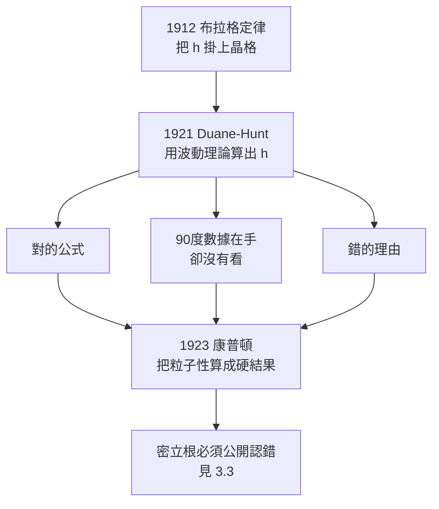

# 3.1 X 射線的十年迷航：密立根與 duane-Hunt 的意外

## 1912 年，蘇黎世，一張底片上的四個斑點

1912 年，瑞士蘇黎世大學。麥克斯·馮·勞厄（Max von Laue, 1879–1960）產生了一個念頭：把一束 X 射線穿過一片單晶。實際操作交給他的助手弗里德里希·克尼平（Friedrich Knipping）。晶體後面夾一張底片，外面再蓋一層黑紙，擋掉被衍射的可見光。

底片沖出來，上面有四個亮斑——不是一片模糊，而是一組有規則排列的點。

這四個斑點意味著：X 射線不是一束「穿牆光」，它是一種波，而且晶體本身就是它的光柵。$E = h\nu$ 第一次不再只是一個關於黑體的數學技巧，它變成了一把能量尺。

## 從格子到波長：布拉格父子

同年 12 月，英國利茲大學。老威廉·亨利·布拉格（William Henry Bragg, 1862–1942）和他的兒子威廉·勞倫斯·布拉格（William Lawrence Bragg, 1890–1971）用氯化鈉晶體做 X 射線反射，得到一條極簡單的規則：

$$n\lambda = 2d\sin\theta$$

$n$ 為繞射級數，$d$ 為晶面間距，$\theta$ 為掠射角。把第一章的兩條關係塞進去，右邊立刻換了一張臉：

$$\lambda=\frac{hc}{E},\qquad n\lambda=2d\sin\theta\;\Longrightarrow\;nh\nu=2cd\sin\theta$$

**X 射線的量子性質幾乎是白送的。** 晶格距離 $d$ 可以先用波長已知的 Cu Kα 射線校準出來（用已知晶體定尺，再回頭量新樣品），$\theta$ 用角度計讀，$\nu$ 用吸收邊（absorption edge，即材料對某個臨界頻率以上突然變得不透明）讀。$h$ 於是第一次有一條**獨立於黑體輻射的量測路徑**。

| 從「湊合常數」到「可測常數」 | 1900–1912 | 1912 之後 |
|---|---|---|
| $h$ 的來源 | 為了讓黑體公式收斂而調出的參數 | 由截止波長、吸收邊、量子方程分別定出 |
| 獨立檢驗 | 無 | 至少三條互不相干的路徑 |
| 地位 | 數學裝置 | 可與 $c$、$e$ 並列的基本常數 |
## 然後是十年的空白

1921 到 1923 年之間，物理學界手上已經同時有：布拉格定律、可量的晶格距離、可被單個光子計數的光。那麼為什麼沒有人立刻去做「用 X 射線散射檢驗光量子假說」？

兩個技術理由。X 射線波長 $\lambda\sim 10^{-10}\,\mathrm{m}$，波動光學裡決定散射的因子是 $1-\cos\theta$ 這類小量；角度計的鑑別度若只有 $\sim 0.5^\circ$，換算成波長誤差就足以淹沒訊號。

但真正的原因不是沒有儀器，而是**沒有人想到要去散射 X 射線**。1912 到 1923 年，整個領域的注意力都集中在 X 射線的**繞射與吸收**上——繞射太成功了，成功到讓人以為問題已經結束。

## 1921 年，哈佛的一個意外

就在這段空白裡，哈佛大學的威廉·杜安（William Duane）和研究生珀西·亨特（Percy Hunt）做了一件極其重要的事，而且他們**用錯誤的理由得到了對的結果**。

他們讓一束速度為 $v$ 的電子撞擊固定的鎢靶，測 X 射線的連續譜。發現：當電子的動能有上限時，X 射線譜的**短波端會出現一道刀切的截止**——再往下就沒有線了。對應的物理圖像是：電子在減速時把**全部**動能一次交出去，就到此為止。

$$h\nu_{\max}=\frac{1}{2}mv^2,\qquad \lambda_{\min}=\frac{2hc}{mv^2}$$

這就是後來以他們命名的 **Duane–Hunt 極限**。請注意這裡的微妙之處：式子裡的 $h$ 是從 $E = h\nu$ 這個「頻率換算成能量」的既成關係裡借來的，杜安和亨特**完全不需要相信光量子說**。他們的論證是純粹的波動理論：既然電子交出去的能量不會超過 $\frac{1}{2}mv^2$，而波的能量與頻率成正比，那麼頻率就不會超過對應的值。$h$ 在這裡是一把**翻譯尺**，不是一顆粒子。

這是一個用波動理論硬算出 $h$ 的漂亮例子，也是全書反覆出現的模式的第一次出場：**正確的公式、錯誤的理由。**

## 錯過的機會

杜安和亨特的裝置在幾何上本來就能看見康普頓偏移，只是沒人去看。他們讓 X 射線以接近 $90^\circ$ 的方向量測散射譜——而 $90^\circ$ 恰恰是偏移量最大的角度。康普頓偏移在那個角度的量值是 $2.43\times10^{-12}\,\mathrm{m}$，換算成波長約 $0.024\,\text{Å}$。

事後看，杜安和亨特手裡可能已經握著康普頓效應的數據：他們測的是「短波截止」，沒有系統地掃過散射角。康普頓後來在論文中明確指出，這個效應在任何散射角下都應該看得到，而且 $\theta$ 越大越明顯。

## 智識核心：歷史不是線性的

三件事同時發生：對的公式、錯的理由、錯過的機會。科學史常被講成「正確的直覺勝出」的連續劇，但 1921 年檯面上的其實是「直覺贏了，理由輸了，而且它差點連贏的機會都沒有」。

## 本章小結

- **勞厄繞射**（1912）證明 X 射線有波長，**布拉格定律** $n\lambda=2d\sin\theta$ 隨即把 $h$ 與可量的晶格距離掛鉤，讓 $h$ 從湊合參數升格為可獨立測量的基本常數。
- X 射線的量子性質幾乎白送：代進 $E=h\nu$ 即得 $nh\nu=2cd\sin\theta$。
- 1921–1923 年的迷航不是因為儀器不足，而是**沒有人想到用散射去檢驗光量子假說**。
- **Duane–Hunt 極限** $h\nu_{\max}=\frac{1}{2}mv^2$ 是一個用經典波動理論硬算出 $h$ 的漂亮例子：對的公式，錯的理由。
- Duane–Hunt 的 $90^\circ$ 幾何本可看見康普頓偏移（$0.024\,\text{Å}$），他們只測短波截止，錯過了機會。
- 本節的核心命題：**正確的公式、錯誤的理由、錯過的機會可以同時發生；歷史不是線性的。**

## 想一想

1. Duane–Hunt 用波動理論算出的公式，後來被證明與光量子假說給出的結果**完全相同**。一個公式對了，能不能推論產生它的理由也對？請用這一章的例子說明「結論正確但推理無效」在科學中是怎麼發生的。
2. 如果 1921 年杜安和亨特真的把散射角從 $0^\circ$ 掃到 $150^\circ$，他們的數據會不會被當時的學界接受？請想想：一個數據「存在但沒有人注意」與「數據存在且被接受」，中間還差多少東西？
3. 一個用錯誤理由得到的正確結果，會不會反過來強化錯誤的理由？今天的科學教育常把歷史「清理」成只留下正確推理，這樣做對理解有幫還是有害？
