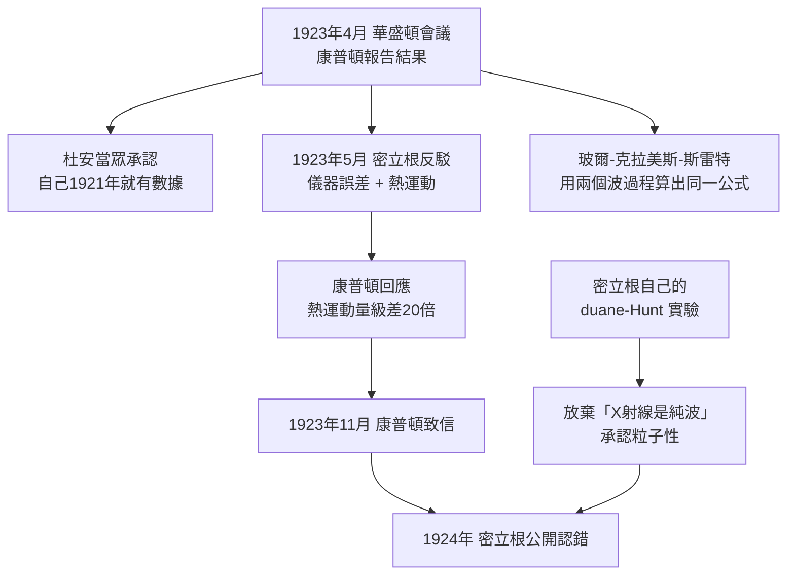

# 3.3 1923 年的華盛頓：玻爾的公式與密立根的沉默

## 1923 年 4 月，華盛頓特區一間擠滿人的會議廳

阿瑟·康普頓站上講台，報告他的 X 射線散射結果：X 射線打到石墨上，散射後的波長變長了，偏移量只由散射角決定，與入射波長無關、與靶材無關。整間屋子都明白這意味著什麼——**光不是純粹的波**。

聽眾裡有杜安（William Duane），就是 3.1 節那個 1921 年用波動理論算出 $h$ 的人。據同時代的記錄，康普頓發表完之後，杜安當眾說了大意這樣一句話：他 1921 年的實驗裡其實已經包含了這個效應，只是當時沒有認出來。**這是科學史上少見的、當眾的、公開的認錯**——不是事後追認，是在報告現場。

而華盛頓大學請去發表「評論」的，是剛拿到 1923 年諾貝爾物理學獎（表彰光電效應）的那位：羅伯特·密立根（Robert Andrews Millikan, 1868–1953）。

## 密立根的第一招：幾何誤差

1923 年 5 月，密立根發表短文質疑康普頓量到的「散射」，提出兩條解釋：

- **儀器誤差**：偏移可能來自光柵光譜儀的幾何校準問題——那個年代的分光計確實難以做到 $0.5^\circ$ 以內的角度定位。
- **石墨的熱運動**：常溫下碳原子在晶格裡以幾百 $\mathrm{m/s}$ 振動，會造成都卜勒式的頻率飄移。

康普頓同月回應，逐條算給你看。熱運動那條很容易估：碳原子均方根速率約 $500\,\mathrm{m/s}$ ，多卜勒相對偏移上界

$$\frac{\Delta\lambda}{\lambda}\lesssim\frac{v}{c}\approx 1.7\times10^{-6},\qquad \Delta\lambda\lesssim 0.0708\times1.7\times10^{-6}\approx 1.2\times10^{-4}\ \mathrm{nm}$$

實測值是 $2.43\times10^{-3}\,\mathrm{nm}$ 。**差了二十倍。** 我的數據在你的實驗精度內，而你提出的兩條替代解釋，一條是儀器問題，一條量級完全不對。

## 密立根的第二招：玻爾給了另一個公式

事情到這裡還有翻盤的可能——因為就在同一段時間，玻爾那邊真的算出來了**另一條能給出正確偏移量的公式**。

尼爾斯·玻爾（Niels Bohr, 1885–1962）、亨里・克拉美斯（Hendrik Kramers）與約翰・斯雷特（John Slater）在哥本哈根發展了一套色散理論，用來解釋原子光譜的組合線與正常塞曼效應。這套理論把「入射光先被電子吸收，再放出另一個頻率的光」分成兩個獨立步驟；克拉美斯把它寫成一個公式——今天稱為**克拉美斯－海森堡公式**（Kramers–Heisenberg formula）——而它對 X 射線非彈性散射的預測，**形式上正好給出康普頓的偏移量**。

這是一個極其微妙的局面：玻爾與他的學生算出對的公式，用對的數學結構，但它描述的是**兩個連續的波過程**——光波先被吸走一點頻率，再放出來。整個機制仍然是經典的、仍然不需要粒子。

於是物理學界面前有兩條路：密立根的路（「你們量錯了」），和玻爾的路（「量沒錯，但機制是兩個波過程」）。第二條路在 1923 年看起來非常誘人，因為它保住了「光是波」。

## 1923 年 11 月，那封信

康普頓在 11 月寫了一封有禮但毫不含糊的信給密立根。大意是：既然我的數據完全落在你實驗的精度範圍內，而你的兩條替代解釋要麼是儀器誤差、要麼量級差了二十倍，我認為必須承認我的結果正確，也希望你公開承認這一點。

密立根在 1924 年發表了修正的評論，承認康普頓的結果正確， $h$ 值也對得上。

但故事還沒完——因為**轉向的真正來源是密立根自己的實驗**。

## 密立根為什麼會轉向

密立根不是被打敗才轉向的，他是**被自己的數據轉向的**。3.1 節講過的 Duane–Hunt 效應，密立根自己接手做了更完整的版本：當自由電子帶著動量撞上固定的鎢靶時，X 射線短波截止所對應的動量守恆，要求把全部動量交給 X 射子；而用波動語言把這件事算出來，最方便的寫法裡必然出現 $h$ 。

據史料整理，密立根在 1923 年 11 月前後用實驗確認這個效應，並在 1924 年上半年發表。**他自己放棄了「X 射線是純波」的立場。** 這是他一生中最徹底的一次轉向——第一次是 1916 年接受密立根－岡姆森實驗算出的電子電荷（這讓他拿到 1923 年諾貝爾獎，也是他反對愛因斯坦光量子假說的資本），第二次就是這一次。

順帶一提，密立根在 1922 年前後對年輕的理論物理學家相當刻薄，關於玻爾的意見據說大意是「像玻爾這樣的人是不可相信的」。這話不算罕見，卻說明一件事：**他反對的不是康普頓這個人，是「光是粒子」這個想法。** 一旦他自己的實驗指向粒子，他就轉向得非常徹底。

## 歷史意義

1923 年之前，「光量子」（light quantum）是愛因斯坦 1905 年提出、普朗克 1911 年公開反對、Born 建議放棄這個詞的理論配件——2.4 節說過它是「湊合的數學技巧」。

1923 年之後，它有了三樣東西：玻爾的公式（數學上無懈可擊）、康普頓的數據（實驗上無可辯駁）、密立根的認錯（權威上無路可退）。

這就是「概念的歷史比實驗的歷史長」的具體化：**一個概念可以比它的實驗證據早存在二十二年，而且靠著它自己的數學一致性存活下來。** 一旦實驗趕上，就再也趕不回去了。

## 本章小結

- 1923 年 4 月華盛頓會議上，**杜安公開承認**自己 1921 年的實驗已含此效應，只是當時沒認出來。
- 密立根 1923 年 5 月的反駁有兩條：光柵光譜儀的**幾何誤差**、石墨的**熱運動紅移**。
- 康普頓的回應是數量級的：熱運動造成的偏移比實測值**小約二十倍**。
- **玻爾－克拉美斯－斯雷特理論**用兩個連續波過程算出了形式正確的偏移量——對的公式，錯的機制。
- 1923 年 11 月康普頓致信要求密立根公開承認；1924 年密立根承認結果與 $h$ 值正確。
- 轉向的真正來源是**密立根自己的 Duane–Hunt 實驗**：他放棄「X 射線是純波」，承認粒子性。
- 1923 年後，光量子從「湊合的數學技巧」變成「有實驗支持的物理實體」。

## 想一想

1. 玻爾的理論算出了對的公式卻拒絕粒子解釋，密立根算出了對的公式卻用了粒子解釋。**誰的態度更接近今天的物理學？** 請說明你的判準。
2. 一位剛靠光電效應拿到諾貝爾獎的權威，公開否定了另一位實驗家的結果三個月。如果是你在台下，你會怎麼處理這個處境？
3. 一個概念可以靠數學自洽性存活二十二年而沒有任何直接實驗支持。今天的理論物理裡還有這樣的概念嗎？它們靠什麼存活？
