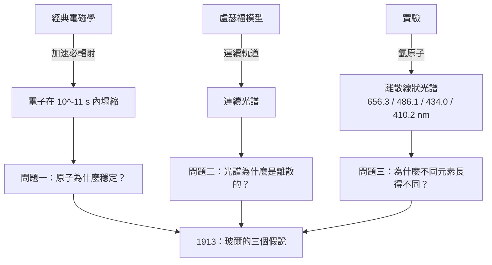

# 4.2 為什麼電子不會掉進原子核

## 先算一下：電子墜落要多少時間

假設氫原子裡的電子真的在畫半徑 $r = 10^{-10}\,\mathrm{m}$ 的圓。庫侖力提供向心力：

$$\frac{m_e v^2}{r} = \frac{e^2}{4\pi\varepsilon_0 r^2}\ \Longrightarrow\ v = \sqrt{\frac{e^2}{4\pi\varepsilon_0 m_e r}} \approx 2.2\times10^{6}\ \mathrm{m/s}$$

$v/c \approx 0.007$ ，所以非相對論公式還夠用。繞一圈的時間是

$$T = \frac{2\pi r}{v} \approx 3.0\times10^{-16}\,\mathrm{s} = 0.3\ \text{飛秒}$$

$1\,\mathrm{fs} = 10^{-15}\,\mathrm{s}$ 。也就是說，電子每 0.3 飛秒繞核一圈——比可見光週期（約 $2\times10^{-15}\,\mathrm{s}$ ）還短。

接著是蘭克多夫–托爾斯公式（1904 年前後）：**做加速運動的電荷以功率 $P$ 輻射**

$$P = \frac{e^2 a^2}{6\pi\varepsilon_0 c^3},\qquad a = \frac{v^2}{r}$$

電子的總能量（動能加位能）現在是負的，代表這是束縛能：

$$E = \frac{1}{2}m_ev^2 - \frac{e^2}{4\pi\varepsilon_0 r} = \frac{1}{2}\frac{e^2}{4\pi\varepsilon_0 r} - \frac{e^2}{4\pi\varepsilon_0 r} = -\frac{1}{2}\frac{e^2}{4\pi\varepsilon_0 r}\approx -13.6\ \mathrm{eV}$$

把能量除以輻射功率，得到「還能撐多久」：

$$\frac{|E|}{P} = \frac{\tfrac{1}{2}\,\frac{e^2}{4\pi\varepsilon_0 r}}{\frac{e^2}{6\pi\varepsilon_0 c^3}\left(\frac{e^2}{4\pi\varepsilon_0 m_e r^2}\right)^2} \sim 10^{-11}\,\mathrm{s}$$

**原子應該在 $10^{-11}$ 秒內塌縮**，也就是繞 $10^5$ 圈之後，電子就沒了。整個人類歷史都不到一秒。

## 這不是風格問題，是物理問題

塌縮不是「不太好看」，它會直接把你腳下的東西抽走。電子掉進核，核的電荷就被中和，於是**化學鍵失效、固體變成等離子體**。後來有人據此估算過：地球上的水會在幾百年內被電子的輻射蒸發到太空。玻爾在學生時代處理金屬的電子理論時，就已經繞不開「原子為什麼不塌」這個問題。

費曼後來用一種近乎狡辠的方式處理它（大意是）：你之所以覺得原子沒塌，是因為你正在看它；打開箱子，電子塌了，你一看就又回來了。這個說法有趣，但它把因果關係倒過來當答案用——20 世紀中葉的物理學界並不接受，它只是把問題正式推到了「測量是什麼」那條路上（本書第十二、十七章會回到這裡）。

## 難題其實是兩個：穩定，加上離散的譜線

第二個問題比第一個更難，因為它是實驗逼出來的。

盧瑟福模型裡，電子的連續圓周運動會發出**連續**頻率的輻射。可氫原子在放電時發出的是**離散**的線狀光譜：在可見光區有四條——656.3、486.1、434.0、410.2 nm；紫外一組、紅外一組，而且**每一種元素的光譜都不一樣，像指紋一樣**（Bunsen 與 Kirchhoff 在 1860 年代正是靠這個原理做出化學分析的）。

1885 年，瑞士一位中學數學教師 Johann Balmer——只有業餘愛好的身分——在六十多歲時，靠猜測把這四條可見線的規律寫成

$$\lambda = B\frac{n^2}{n^2-4},\qquad B = 364.6\ \mathrm{nm}$$

1889 年，Rydberg 把它推廣成更對稱的形式 $\lambda^{-1} = R\left(\frac{1}{n_1^2}-\frac{1}{n_2^2}\right)$ 。（順帶一提：Rydberg 當年在信裡拿公式常數 $B$ 和德文裡 Balmer 的「頭髮」開過玩笑，這個雙關後來常被拿來說明科學圈的幽默感；他的公式裡還藏著 $\frac{1}{137}$ ，那是精細結構常數 $\alpha$ ，第 15–16 章會回來。）

於是 1912 年底，物理學家手上有的是：對的力學（牛頓＋庫侖）、對的原子大小、對的核，而且有了一條誰都猜不出來源的**光譜公式**。缺的只有一個東西——**為什麼電子可以永遠不下墜，並且只發出那幾個頻率。**

三個問題必須**同時**被回答，因為任何一個單獨解釋都不算數。1913 年 3 月，玻爾在三頁紙裡同時回答了這三個。

## 本章小結

- 圓周運動的電子速度 $v\approx2.2\times10^{6}\,\mathrm{m/s}$ ，週期 $T\approx3.0\times10^{-16}\,\mathrm{s}$ （0.3 飛秒），向心力由庫侖力提供。
- 蘭克多夫–托爾斯公式 $P=\frac{e^2a^2}{6\pi\varepsilon_0c^3}$ 說加速電荷必輻射；束縛能除以輻射功率，給出**塌縮時間 $\sim10^{-11}\,\mathrm{s}$ **。
- 這個數字不只是學術問題：電子落進核會讓化學鍵失效、水被蒸發到太空。物質的穩定性需要機制。
- 第二個問題更致命：盧瑟福模型只能給**連續**光譜，實驗卻是**離散**的線狀光譜，而且每種元素都是獨特的「指紋」。
- **Balmer（1885）**與 **Rydberg（1889）** 先寫出了 $\lambda^{-1}=R(\frac{1}{n_1^2}-\frac{1}{n_2^2})$ ，但沒人知道它從哪來。
- 問題收束成三條：**穩定性、離散光譜、元素的差異**。這正是玻爾三個假說要同時回答的對象。

## 想一想

1. 費曼說「因為有人在看，原子才沒塌」。請你認真評價這個論述：如果它是對的，我們平常呼吸、桌上的杯子、這本書，是不是全都靠「被觀察」維持著？
2. 塌縮時間 $\sim10^{-11}$ 秒是「 $|E|/P$ 」這個極粗糙的估算給出的。如果電子不是圓周運動而是某種軌道，這個數字會變嗎？改變的話是因為什麼物理量？
3. Balmer 是靠猜測六條數學曲線才對上四條譜線的。今天的理論物理學還允許這種「先猜對形式再說」的作法嗎？還是說你認為背後其實有一個更強的版本的方法論？
