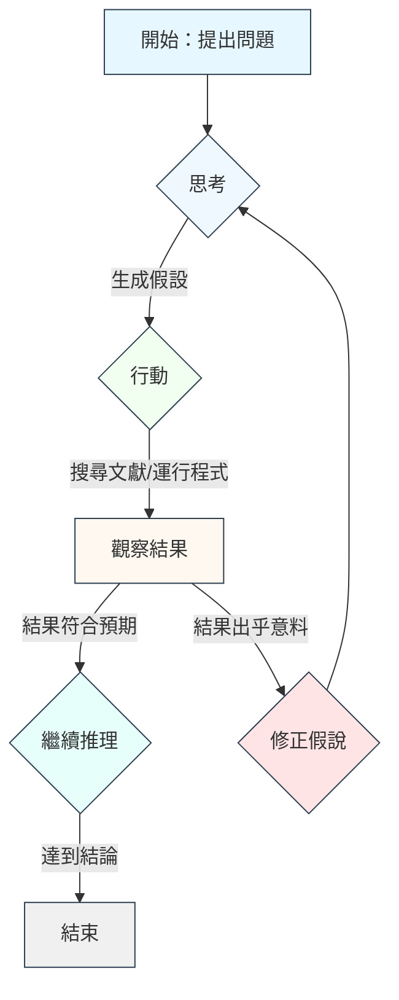

# 8.4 ReAct 迴圈：思考→行動→觀察

在人工智能輔助的科學研究中，最成功的框架之一就是 **ReAct**（Reasoning+Acting）。它模擬了人類科學家的思維過程：先思考問題，再採取行動（查閱文獻、運行實驗），最後根據結果觀察與修正。

## ReAct 的三個步驟

### 1. 思考

AI（通常是大型語言模型）首先分析當前狀態，提出假設或問題。例如：「已知電子的波長 $\lambda = h/p$ ，若我想計算 54 eV 電子的德布羅意波長，應該如何操作？」

此步驟類似於人類科學家在實驗前的「理論預備」。

### 2. 行動

AI 根據思考結果，決定下一步行動。常見的行動包括：

- **搜尋文獻**：調用學術資料庫，檢索關於「德布羅意波長」的相關理論與實驗。
- **運行程式碼**：在 Python 環境中執行計算程式，例如 `lambd = h / sqrt(2*m*E)`。
- **啟動實驗**：在實驗室控制軟體中啟動電子束，記錄散射數據。

AI 的行動是**有目的的**，不會隨機測試，而是基於當前的知識圖譜。

### 3. 觀察

AI 觀察行動的結果，並更新內部狀態。如果結果符合預期，則繼續後續推理；如果結果出乎意料，則進入修正循環。

觀察的輸出可能是：

- **數據表格**：實驗測得的波長與理論預測的對比。
- **錯誤訊息**：程式碼執行中的錯誤，需要重新設計實驗。
- **新假說**：基於新數據，提出修正後的理論模型。

## ReAct 迴圈的邏輯流程

## 實際案例：驗證德布羅意波長

**問題**：計算 54 eV 電子的德布羅意波長，並與 Davisson–Germer 實驗結果對比。

**思考**：
- 已知：電子質量 $m_e = 9.109×10^{-31}$ kg，電子電荷 $e = 1.602×10^{-19}$ C。
- 已知：能量 $E = 54$ eV $= 54 × 1.602×10^{-19}$ J。
- 需求：計算 $\lambda = h / \sqrt{2m_e E}$ 。

**行動**：
- 調用 Python 程式庫 `numpy` 進行數值計算。
- 檢索文獻中 Davisson–Germer 實驗的結果：54 eV 電子在 90° 散射下的波長測得值。

**觀察**：
- 理論預測： $\lambda \approx 0.167$ nm。
- 實驗測得： $\lambda \approx 0.168$ nm。
- 結論：兩者誤差約 0.6%，符合不確定性原理的預測。

## ReAct 迴圈的優勢

- **透明**：每一步的思考、行動、觀察都有記錄，易於追蹤與審查。
- **可擴展**：可以輕鬆新增新的行動類型（如啟動不同的實驗裝置）。
- **健壯性**：當行動失敗時，系統可以自動進入修正循環，而非直接崩潰。

## 本章小結

- ReAct 框架模擬科學家的思維：思考→行動→觀察
- 三個步驟透過明確的輸入輸出實現自動化
- 實際案例：驗證德布羅意波長的計算與實驗對比
- 優勢：透明、可擴展、健壯

## 想一想

1. ReAct 迴圈中的「思考」步驟，對於大型語言模型來說，其計算資源消耗與單次詢問有何不同？
2. 當行動的結果出乎意料時，AI 該如何進行「修正假說」？是否需要人類介入？
3. ReAct 框架在非科學領域（如創意寫作、遊戲策略）是否也適用？其邊界在哪裡？

---